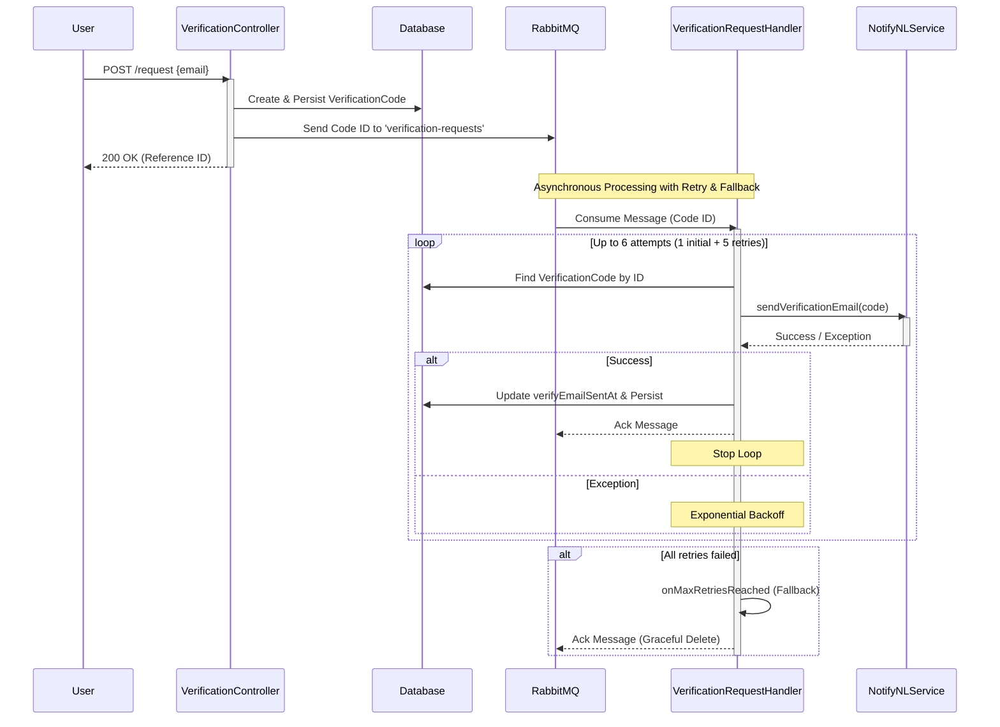
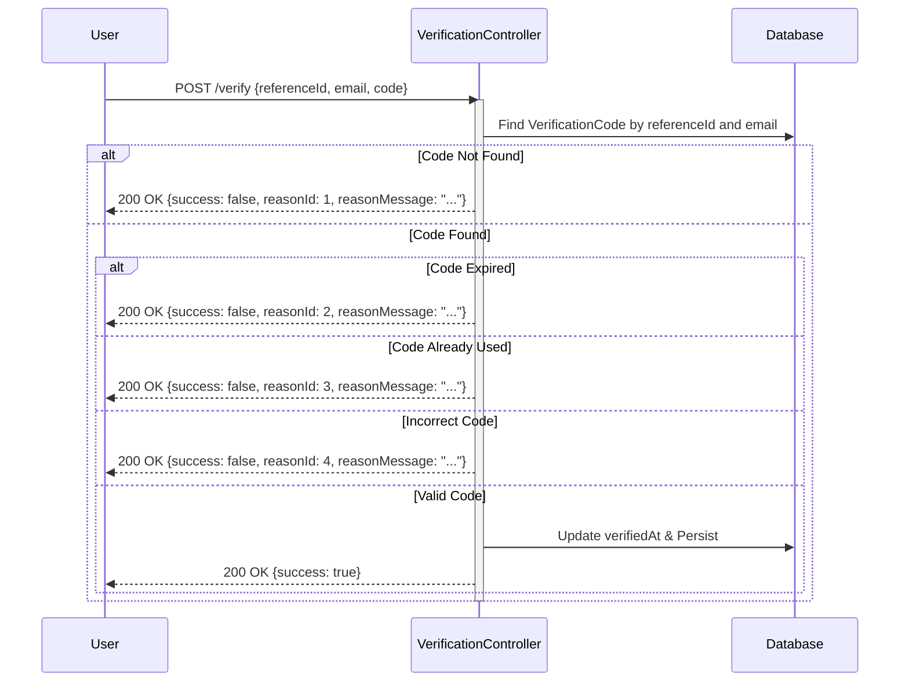
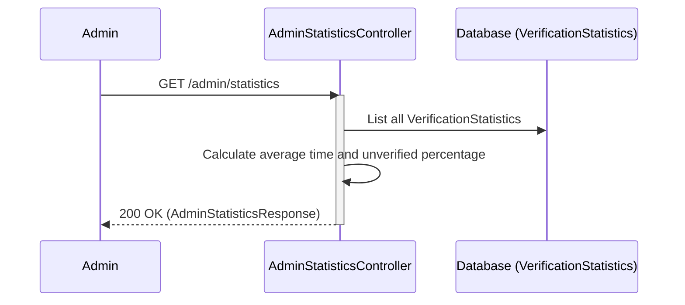

# Verification Service Sequence Diagrams

This document contains sequence diagrams for the main endpoints of the Verification Service.

## 1. Verification Request Flow

This flow describes how a verification request is created and how the verification email is sent asynchronously.

## 2. Verification Completion Flow

This flow describes how a user verifies their email using the received code.

## 3. Admin Statistics Flow

This flow describes how an administrator retrieves statistics about verification requests.

